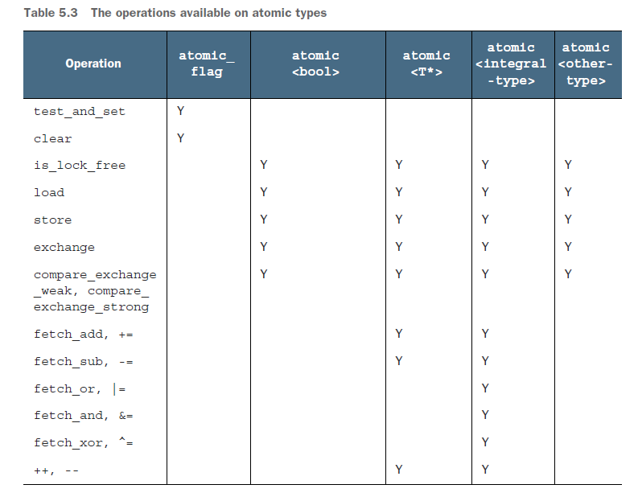

# The C++ memory model and operations on atomic types

* The details of the C++ memory model
* The atomic types provided by the C++
* Standard Library
* The operations that are available on those types
* How those operations can be used to provide synchronization between threads

## Memory model basics

### Objects and memory locations

### Objects, memory locations, and concurrency

If two threads access separate memory locations, there’s no problem: everything works fine. On the other hand, if two threads access the same memory location, then you have to be careful. If neither thread is updating the memory location, you’re fine; read-only data doesn’t need protection or synchronization. If either thread is modifying the data, there’s a potential for a race condition.

### Modification orders

Every object in a C++ program has a modification order composed of all the writes to that object from all threads in the program, starting with the object’s initialization.

## Atomic operations and types in C++

**An atomic operation is an indivisible operation**. You can’t observe such an operation half-done from any thread in the system; it’s either done or not done.

In C++, you need to use an atomic type to get an atomic operation in most cases.

### The standard atomic types

The standard atomic types can be found in the `<atomic>` header.

`std::atomic<T>::is_lock_free()`: Checks whether the atomic operations on all objects of this type are lock-free.
* true: operations on a given type are done directly with atomic instructions
* falase: done by using a lock internal

If the atomic operations themselves use an internal mutex then the hoped-for performance gains will probably not materialize, and you might be better off using the easier-to-get-right mutex-based implementation instead.

C++17, all atomic types have `a static constexpr member variable, X::is_ always_lock_free`, which is true if and only if the atomic type X is lock-free for all supported hardware that the output of the current compilation might run on.

The only type that doesn’t provide an `is_lock_free()` member function is `std::atomic_flag`. This type is a simple Boolean flag, and operations on this type are required to be lock-free.

`std::atomic<T>`: The standard atomic types are not copyable or assignable in the conventional sense, in that they have no copy constructors or copy assignment operators.

atomic operations are divided into three categories:
* Store operations
* Load operations
* Read-modify-write operations

### Operations on `std::atomic_flag`

```c++
// Objects of the std::atomic_flag type must be initialized with ATOMIC_FLAG_INIT
// It's the only atomic type to require such special treatment for initialization
// but it's also the only type guaranteed to be lock-free.
std::atomic_flag f = ATOMIC_FLAG_INIT;

// destroy it, clear it, or set it and query the previous value
// destructor, the clear() member function, and the test_and_set() member function
```

All operations on an atomic type are defined as atomic, and assignment and copy-construction involve two objects. A single operation on two distinct objects can’t be atomic. In the case of **copyconstruction or copy-assignment**, the value must first be read from one object and then written to the other. These are two separate operations on two separate objects, and the combination can’t be atomic.

```c++
// Implementation of a spinlock mutex using std::atomic_flag
class spinlock_mutex
{
    std::atomic_flag flag;
public:
    spinlock_mutex() : flag(ATOMIC_FLAG_INIT) {}
    void lock()
    {
        while(flag.test_and_set(std::memory_order_acquire));
    }
    void unlock()
    {
        flag.clear(std::memory_order_release);
    }
};
```

### Operations on `std::atomic<bool>`

```c++
// the assignment operators they support return values (
// of the corresponding non-atomic type) rather than references.
std::atomic<bool> b(true);
b = false;

// Unlike most assignment operators,
// the assignment operators for atomic types do not return a reference to
// their left-hand arguments. They return a copy of the stored value instead.

std::atomic<bool> b;
bool x = b.load(std::memory_order_acquire);
b.store(true);
x = b.exchange(false, std::memory_order_acq_rel);

// compare-exchange operations
// compare_exchange_weak()
// compare_exchange_strong()
```

### Operations on `std::atomic<T*>`: pointer arithmetic

```c++
// pointer arithmetic operations, return the original value
// fetch_add()
// fetch_sub()
```

### Operations on standard atomic integral types

Only division, multiplication, and shift operators are missing. Because atomic integral values are typically used either as counters or as bitmasks.

### The `std::atomic<>` primary class template

The presence of the primary template allows a user to create an atomic variant of a user-defined type, in addition to the standard atomic types.

In order to use `std::atomic<UDT>` for some user-defined type UDT,, this type must have a **trivial copyassignment operator**. This permits the compiler to use `memcpy()` or an equivalent operation for assignment operations.

* The type must not have any virtual functions or virtual base classes and must use the compiler-generated copy-assignment operator.
* Every base class and non-static data member of a user-defined type must also have a trivial copy-assignment operator.



### Free functions for atomic operations

The nonmember functions are named after the corresponding member functions but with an atomic_prefix (for example, `std::atomic_load()`). Whereas the atomic object being referenced by the member functions is implicit, all the free functions take a pointer to the atomic object as the first parameter.

The C++ Standard Library also provides free functions for accessing instances of `std::shared_ptr<>` in an atomic fashion

```c++
std::shared_ptr<my_data> p;

void process_global_data()
{
    std::shared_ptr<my_data> local = std::atomic_load(&p);
    process_data(local);
}

void update_global_data()
{
    std::shared_ptr<my_data> local(new my_data);
    std::atomic_store(&p,local);
}
```